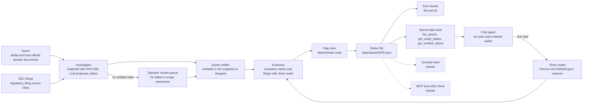

<div align="center">


<h1>Recon</h1>

<p>An AI agent that checks what tokenized real-world asset issuers claim against Stellar on-chain data.</p>

<p>
  
  
  
</p>

</div>

---

## Contents

- [Project description](#project-description)
- [Key features](#key-features)
- [Tools the agent supports](#tools-the-agent-supports)
- [Supported AI models](#supported-ai-models)
- [Tech stack](#tech-stack)
- [How it works](#how-it-works)
- [Demo video and links](#demo-video-and-links)
- [Trying the app](#trying-the-app)
- [Running locally](#running-locally)
- [Repository layout](#repository-layout)
- [Design notes](#design-notes)
- [Future scope](#future-scope)
- [Social links](#social-links)

## Project description

Issuers of tokenized treasuries, funds, bonds, and commodities publish their claims in PDFs and web pages: who the custodian is, what backs the token, when the last attestation was. Comparing those claims with on-chain data is manual work. Lenders and other agents need machine-readable facts, not a prospectus to read.

Recon is an agent that does this comparison. It reads each issuer's `stellar.toml` and official documents, extracts claims with exact quotes, reads Stellar mainnet, and computes flags in deterministic code. It reports facts and flags, never grades. It reads mainnet and writes only to testnet.

The scope is non-stablecoin real-world assets on Stellar: tokenized treasuries, funds, bonds, and commodities. Yield-bearing dollar products such as USDY are in scope and labeled `yield-bearing`. Stablecoins are out of scope. The current universe has 27 assets from six issuers ([`data/assets.csv`](data/assets.csv), as of 2026-10-08).

## Key features

- **Live mainnet read.** Ask the chat agent about an asset code. It checks the issuer against the official domain pinned for that asset, then reports supply, authorized trustlines, funded holders, and issuer flags.
- **Quote or discard.** Every extracted claim carries the exact quote, source URL, page, and the SHA-256 of the document snapshot. Code drops a claim whose quote is not found in the snapshot.
- **The LLM proposes, code decides.** The model finds, reads, and extracts. Flags and statuses come from deterministic code over stored files. The model never sets a status.
- **Nine flag rules.** Each flag is raised, clear, or not evaluated, with a dated statement and evidence links. Example form: `Mismatch between {document} ({page}) and on-chain {value} as of {date}.` Facts and flags only, no grades.
- **Fact sheets in English and Indonesian.** One page per asset at `/en/assets` and `/id/assets`, built from the newest status file.
- **Issuer identity anchored to `stellar.toml`.** Asset codes are not unique, so each asset is pinned to one `home_domain` with evidence.
- **Issuer documents are untrusted data.** Instructions inside them are never followed. SEC filings are a separate source class, `regulatory_filing`.
- **Operator review queue.** Failed or empty extractions are listed. Reviewed proposals pass through the same verifier.
- **Testnet agent wallet.** The agent has its own Stellar testnet wallet, funded by Friendbot.
- **Capped LLM spend.** Daily token budget, output cap, step limit, and rate limits. Only free-tier API keys are used.

## Tools the agent supports

Six tools. Every tool is read-only except `fund_my_wallet`, which writes to testnet only. No tool sets a status.

| Tool | Status | What it does |
| --- | --- | --- |
| `get_my_wallet` | shipped | Get the agent's own Stellar testnet wallet: address, balances, and an explorer link. |
| `fund_my_wallet` | shipped | Fund the agent's testnet wallet with Friendbot (free test XLM). Testnet only. |
| `check_asset` | shipped | Read-only mainnet check of an asset: issuer identity against the pinned official domain, total supply, authorized trustlines, funded holders, flags, and the largest holder's share. Without an issuer, it lists the issuers that use the code and whether each verifies. |
| `list_assets` | shipped | List every tracked asset (non-stablecoin RWAs on Stellar mainnet): code, issuer, organization, type, home domain (from stellar.toml), and the stored status with its as-of date. Stored data, no live reads. |
| `get_asset_status` | shipped | The stored status of one asset from the latest status file: status, as-of date, each raised flag with its exact statement and date, and the fact sheet path. Code computes the status; the model only relays it. |
| `get_verified_claims` | shipped | Claims from an issuer's own documents or regulatory filings (custodian, auditor, net assets, NAV, and more), each with an exact quote that code found verbatim in the document snapshot, the source URL, page, and snapshot SHA-256. Quotes are untrusted issuer text. At most 10 per call. |

## Supported AI models

Models are switchable by environment variables: `LLM_PROVIDER` (`google`, `groq`, or `openrouter`) and `LLM_MODEL` for chat, and `LLM_EXTRACT_PROVIDER` and `LLM_EXTRACT_MODEL` for claim extraction. Only free-tier keys are used.

| Role | Provider | Model | Version note |
| --- | --- | --- | --- |
| Chat on the live app | Google | `gemini-flash-lite-latest` | Google's alias for the newest Gemini Flash-Lite. The alias can move, so the exact version behind it is not pinned here. |
| Claim extraction (default) | Google | `gemini-3.7-flash`, thinking level low | Picked by the W2.6 benchmark. |
| Benchmarked, extraction | Google | `gemini-3.5-flash-lite` | Same extraction windows. |
| Benchmarked, extraction | Groq | `openai/gpt-oss-120b` | Same extraction windows. |
| Benchmarked, extraction | OpenRouter | `nvidia/nemotron-3-super-120b-a12b:free` | Same extraction windows. |

**Benchmark (as of 2026-10-09).** Four free-tier configs ran on the same 15 issuer documents (the OpenRouter config failed on 3 of them and was scored on the other 12), scored against a frozen hand-checked gold set of 50 items, 30 of them verifiable by the current verifier. `gemini-3.7-flash` had the highest precision and recall of the four: precision 83.3% (95% interval 60.8-94.2, n=18 verified claims) and recall 50.0% (33.2-66.8, n=30). The sample is small and one run per config was made, so these numbers describe this 15-document sample only. Scores and runs: [`data/benchmark/scores.json`](data/benchmark/scores.json) and [`data/benchmark/runs/`](data/benchmark/runs/).

## Tech stack

| Layer | Technology | Version |
| --- | --- | --- |
| Framework | Next.js (App Router) | 16.3.8 |
| UI | React | 19.3.0 |
| Language | TypeScript | 5.9.3 |
| Styling | Tailwind CSS | 4.3.3 |
| Components | shadcn | 4.21 |
| LLM layer | Vercel AI SDK (`ai`) | 7.0.128 |
| LLM providers | `@ai-sdk/google` | 4.0.88 |
| | `@ai-sdk/groq` | 4.0.59 |
| | `@ai-sdk/openai-compatible` (OpenRouter) | 3.0.67 |
| Stellar | `@stellar/stellar-sdk` (Horizon and StellarExpert reads on mainnet; testnet wallet) | 17.2.1 |
| Validation | zod | 4.6.5 |
| TOML parsing | smol-toml | 1.9 |
| PDF text | unpdf | 1.8.1 |
| Tests | vitest | 5.0.3 |
| Hosting | Vercel | n/a |

**Planned (not shipped, not in the repository yet):** the Soroban feed contract in Rust, in `contracts/feed/`, with `soroban-sdk` 29.0.0.

## How it works



The Investigator finds documents on the issuer's official domain (the domain whose `stellar.toml` lists the issuer account), snapshots them, and asks an LLM to propose claims. Code keeps a claim only if its exact quote appears in the snapshot. Documents where extraction fails go to a review queue and pass through the same verifier.

The Examiner compares verified claims and filings with Stellar mainnet data. Flag rules are pure functions over the stored evidence, so the same inputs always produce the same status file. Fact sheets are built from that file. The dashed nodes are not shipped yet.

## Demo video and links

- Week 1 (recon.v1): video coming on 2026-10-10
- Week 2 (recon.v2): coming
- Week 3 (recon.v3): coming

**Live app:** https://recon-agent-opal.vercel.app

**For judges:** progress, proof links, worked examples, and scope are in [`agentmaxxing/`](agentmaxxing/).

## Trying the app

1. Open the live app (or `http://localhost:3000` after `npm run dev`).
2. Click the example prompt "Check USTRY on Stellar mainnet".
3. Expand the tool call in the chat. `check_asset` shows its input and the raw result: issuer identity, supply, trustlines, flags, and the sources it read.
4. Open **Fact sheets** (`/en/assets`, or `/id/assets` in Indonesian).
5. Open USTRY, then BB1. Each raised flag has a dated statement and links to the evidence behind it.

Local only: step 1 of the setup panel needs your Gemini key in `frontend/.env`. "Create wallet" makes a testnet wallet and funds it with Friendbot. The prompts "What's in your wallet?" and "Fund your wallet on testnet" use it.

## Running locally

Requires Node.js. From `frontend/`:

```bash
npm install
cp .env.example .env     # add a free Gemini API key (https://aistudio.google.com/apikey)
npm run dev              # http://localhost:3000
npm test                 # unit tests, no network
```

Pipeline commands, also from `frontend/`:

| Command | What it does |
| --- | --- |
| `npm run check:assets` | Read-only mainnet check of every asset in `data/assets.csv` -> `data/checks/DATE.json` |
| `npm run snapshot:docs` | Fetch and hash issuer documents -> `data/snapshots/` |
| `npm run extract:claims` | LLM extraction with quote check -> `data/claims/` (`--reverify` runs offline) |
| `npm run benchmark` | Compare Gemini, Groq, and OpenRouter free-tier configs on the same extraction windows -> `data/benchmark/runs/` (`--dry-run` shows the estimate; `--windows`, `--list-models`) |
| `npm run benchmark:score` | Score benchmark runs against the gold set -> `data/benchmark/scores.json` (no network, no LLM) |
| `npm run review:queue` | List extractions that need a human look -> `data/review/queue.json` |
| `npm run import:review` | Import reviewed proposals through the quote verifier (no LLM) |
| `npm run examine` | Examination run -> `data/examinations/DATE.json` |
| `npm run status` | Compute flags and status -> `data/status/DATE.json` (no network, no LLM) |
| `npm run build` | Build the app and the fact sheets from the newest status file |

## Repository layout

- `frontend/` - Next.js 16 app (React 19, Tailwind 4): chat UI, API routes, fact sheet pages
- `frontend/agent/` - chat agent, tools, testnet wallet, model layer with usage guards
- `frontend/lib/chain/` - read-only Horizon and StellarExpert reads, SSRF-guarded `stellar.toml` fetch, issuer identity check
- `frontend/lib/documents/` - document discovery from the official domain and SEC EDGAR, snapshot store, HTML and PDF text
- `frontend/lib/claims/` - extraction prompt and parsing, verbatim quote verifier, claim store
- `frontend/lib/examine/` - checks per asset type and bounded investigation of discrepancies
- `frontend/lib/flags/` - the nine flag rules and the status mapping
- `frontend/lib/review/` - operator review queue and import
- `frontend/lib/factsheet/` - fact sheet content in English and Indonesian
- `frontend/scripts/` - the pipeline commands above
- `data/` - asset universe (`assets.csv`), chain checks, snapshots index, claims, examinations, status files
- `agentmaxxing/` - checkpoint progress, proof, examples, and scope
- `contracts/feed/` - Soroban feed contract in Rust (planned; not in the repository yet)

## Design notes

- **The LLM proposes, code decides.** The model finds, reads, and extracts. Statuses, flags, and any future feed update come from deterministic code. A model can be wrong or be manipulated by a document, so it never sets a status.
- **Quote or discard.** Each claim carries the exact quote, source URL, page, and the SHA-256 of the snapshot. A quote must appear exactly once in the snapshot text (only whitespace, typographic quotes, dashes, and PDF ligatures are normalized), and code parses the value from the document's own characters. Raw proposals are stored, so `--reverify` reproduces the result offline.
- **`stellar.toml` is the identity anchor.** Asset codes are not unique (BENJI has 23 issuers on mainnet and USDY 37, as of 2026-10-08). `data/assets.csv` pins one `home_domain` per asset with evidence, and the issuer account must be listed in that domain's `stellar.toml`.
- **Issuer documents are untrusted.** Instructions inside them are never followed. A document is an issuer claim only if it comes from the official domain or a link published there. SEC filings are a separate source class, `regulatory_filing`. Aggregators are for discovery only.
- **Fetching untrusted domains is SSRF-guarded.** A `home_domain` can be set by anyone. Fetches use https, public DNS names only, a checked address at connect time, a redirect limit, a deadline, and a size cap.
- **Flags are pure functions of stored files.** The same stored files always produce the same flags and statuses. Every flag ends as raised, clear, or not evaluated, and raised and clear results carry evidence references. A mismatch statement reads `Mismatch between {document} ({page}) and on-chain {value} as of {date}.` Every statement is a dated fact, with no grades.
- **Operator review goes through the same verifier.** Claims from the review queue are labeled `operator-reviewed`. The review step runs outside the app, and no server route calls it.
- **LLM spend is capped.** A daily token budget that fails closed, an output-token cap, a step limit, a global rate limit, and a per-IP limit when behind a trusted proxy. The limits live in memory and on disk per server instance, so on Vercel the budget is per instance, not global.
- **Read mainnet, write testnet.** The agent wallet is testnet-only and funded by Friendbot. Its secret is never returned or logged.

## Future scope

- **Week 2 (recon.v2, by 2026-10-16):** the Soroban feed contract built and tested; a 7-day hold for issuer flag and signer changes, with the time a change was first seen stored in the status file; a walkthrough demo.
- **Week 3 (recon.v3, by 2026-10-23):**
  - A Soroban feed contract on Stellar testnet that lending protocols and other agents can read, written by the agent's own wallet.
  - An x402-protected check endpoint that settles on Stellar testnet.
  - An MCP server so other agents can query asset status and verified claims.
  - A threat model for the agent and the feed.
- **After:**
  - More assets in the universe.
  - Monitoring: re-check cadence and reaction to on-chain events such as signer changes and large mints or burns.
  - Cited Q&A over stored evidence.

## Social links

- X: product account coming soon
- GitHub: https://github.com/dzakwannajmi/recon

## License

Third-party notices: [THIRD_PARTY_LICENSES.md](THIRD_PARTY_LICENSES.md).
