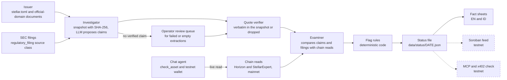

<div align="center">

<h1>Recon</h1>

<p>An AI agent that checks what tokenized real-world asset issuers claim against Stellar on-chain data.</p>

<p>
  
  
  
</p>

</div>

---

Issuers of tokenized treasuries, funds, bonds, and commodities publish their claims in PDFs and web pages: who the custodian is, what backs the token, when the last attestation was. Comparing those claims with on-chain data is manual work, and lenders and other agents need machine-readable facts, not a prospectus to read.

Recon reads each issuer's `stellar.toml` and official documents, extracts claims with exact quotes, reads Stellar mainnet, and computes flags in deterministic code. It reports facts and flags, never grades. It reads mainnet and writes only to testnet.

**Live demo:** https://recon-agent-opal.vercel.app

**Judges:** progress, proof links, worked examples, and scope are in [`agentmaxxing/`](agentmaxxing/).

## How it works



The Investigator finds documents on the issuer's official domain (the domain whose `stellar.toml` lists the issuer account), snapshots them, and asks an LLM to propose claims. Code keeps a claim only if its exact quote appears in the snapshot. Documents where extraction fails go to a review queue and pass through the same verifier.

The Examiner compares verified claims and filings with Stellar mainnet data. Flag rules are pure functions over the stored evidence, so the same inputs always produce the same status file. Fact sheets are built from that file. The dashed nodes are not built yet.

## Repository layout

- `frontend/` - Next.js 16 app (React 19, Tailwind 4): chat UI, API routes, fact sheet pages
- `frontend/agent/` - chat agent, tools, testnet wallet, model layer with usage guards
- `frontend/lib/chain/` - read-only Horizon and StellarExpert reads, SSRF-guarded `stellar.toml` fetch, issuer identity check
- `frontend/lib/documents/` - document discovery from the official domain and SEC EDGAR, snapshot store, HTML and PDF text
- `frontend/lib/claims/` - extraction prompt and parsing, verbatim quote verifier, claim store
- `frontend/lib/examine/` - checks per asset type and bounded investigation of discrepancies
- `frontend/lib/flags/` - the nine flag rules and the status mapping
- `frontend/lib/review/` - operator review queue and import
- `frontend/lib/factsheet/` - fact sheet content in English and Indonesian
- `frontend/scripts/` - the pipeline commands below
- `data/` - asset universe (`assets.csv`), chain checks, snapshots index, claims, examinations, status files
- `agentmaxxing/` - checkpoint progress, proof, examples, and scope

## Running locally

Requires Node.js. From `frontend/`:

```bash
npm install
cp .env.example .env     # add a free Gemini API key (https://aistudio.google.com/apikey)
npm run dev              # http://localhost:3000
npm test                 # 362 tests, no network
```

Pipeline commands, also from `frontend/`:

| Command | What it does |
| --- | --- |
| `npm run check:assets` | Read-only mainnet check of every asset in `data/assets.csv` -> `data/checks/DATE.json` |
| `npm run snapshot:docs` | Fetch and hash issuer documents -> `data/snapshots/` |
| `npm run extract:claims` | LLM extraction with quote check -> `data/claims/` (`--reverify` runs offline) |
| `npm run benchmark` | Compare Gemini, Groq, and OpenRouter free-tier configs on the same extraction windows -> `data/benchmark/runs/` (`--dry-run` shows the estimate; `--windows`, `--list-models`) |
| `npm run benchmark:score` | Score benchmark runs against the gold set -> `data/benchmark/scores.json` (no network, no LLM) |
| `npm run review:queue` | List extractions that need a human look -> `data/review/queue.json` |
| `npm run import:review` | Import reviewed proposals through the quote verifier (no LLM) |
| `npm run examine` | Examination run -> `data/examinations/DATE.json` |
| `npm run status` | Compute flags and status -> `data/status/DATE.json` (no network, no LLM) |
| `npm run build` | Build the app and the fact sheets from the newest status file |

## Trying the app

1. Open the live demo (or `http://localhost:3000` after `npm run dev`).
2. Click the example prompt "Check USTRY on Stellar mainnet".
3. Expand the tool call in the chat. `check_asset` shows its input and the raw result: issuer identity, supply, trustlines, flags, and the sources it read.
4. Open **Fact sheets** (`/en/assets`, or `/id/assets` in Indonesian).
5. Open USTRY, then BB1. Each raised flag has a dated statement and links to the evidence behind it.

Local only: step 1 of the setup panel needs your Gemini key in `frontend/.env`. "Create wallet" makes a testnet wallet and funds it with Friendbot; the prompts "What's in your wallet?" and "Fund your wallet on testnet" use it.

## Design notes

- **The LLM proposes, code decides.** The model finds, reads, and extracts. Statuses, flags, and any future feed update come from deterministic code. A model can be wrong or be manipulated by a document, so it never sets a status.
- **Quote or discard.** Each claim carries the exact quote, source URL, page, and the SHA-256 of the snapshot. A quote must appear exactly once in the snapshot text (only whitespace, typographic quotes, dashes, and PDF ligatures are normalized), and code parses the value from the document's own characters. Raw proposals are stored, so `--reverify` reproduces the result offline.
- **`stellar.toml` is the identity anchor.** Asset codes are not unique (BENJI has 23 issuers on mainnet and USDY 37, as of 2026-10-08). `data/assets.csv` pins one `home_domain` per asset with evidence, and the issuer account must be listed in that domain's `stellar.toml`.
- **Issuer documents are untrusted.** Instructions inside them are never followed. A document is an issuer claim only if it comes from the official domain or a link published there. SEC filings are a separate source class, `regulatory_filing`. Aggregators are for discovery only.
- **Fetching untrusted domains is SSRF-guarded.** A `home_domain` can be set by anyone. Fetches use https, public DNS names only, a checked address at connect time, a redirect limit, a deadline, and a size cap.
- **Flags are pure functions of stored files.** The same stored files always produce the same flags and statuses. Every flag ends as raised, clear, or not evaluated, and raised and clear results carry evidence references. A mismatch statement reads `Mismatch between {document} ({page}) and on-chain {value} as of {date}.` Every statement is a dated fact, with no grades.
- **Operator review goes through the same verifier.** Claims from the review queue are labeled `operator-reviewed`. The review step runs outside the app, and no server route calls it.
- **LLM spend is capped.** A daily token budget that fails closed, an output-token cap, a step limit, a global rate limit, and a per-IP limit when behind a trusted proxy. The limits live in memory and on disk per server instance, so on Vercel the budget is per instance, not global.
- **Read mainnet, write testnet.** The agent wallet is testnet-only and funded by Friendbot. Its secret is never returned or logged.

## Roadmap

- **Week 2 (by 2026-10-16):** extraction accuracy measured on a hand-checked gold set; walkthrough demo.
- **Week 3 (by 2026-10-23):** Soroban feed contract on Stellar testnet, written by the agent's own wallet; an x402 check that settles on testnet; agent access through MCP.
- **After:** monitoring (re-check cadence, reaction to on-chain events) and cited Q&A over stored evidence.

## License

Third-party notices: [THIRD_PARTY_LICENSES.md](THIRD_PARTY_LICENSES.md).
